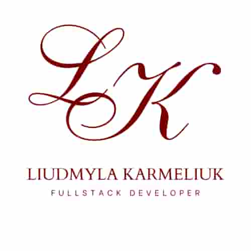

  

## Hi 👋  My name is Liudmyla 

Full Stack Developer specializing in modern web applications using React and Node.js.  
I build clean, responsive, and user-focused interfaces with real-world functionality.  

Experienced in working with APIs, authentication, and modern frontend tools.  
Background in preventive and lifestyle medicine helps me create meaningful, user-centered digital products.

### 🚀 Tech Stack

🧩 Frontend

⚙️ State & Data

🛠️ Backend & Database

🔧 Tools & Workflow

🎨 Design & Collaboration

🚀 Deployment

🤖 AI Tools

### 💡 Soft skills
- Problem-solving 
- Team collaboration
- Communication
- Attention to detail

### 📂 Projects

#### 🧸 Nanny Services App

SPA application for finding babysitters.

**Type:** Individual
**Tech:** React, Firebase, Vite

**Features:**
  - Authentication (login/register)
  - Add to favorites
  - Filtering and browsing nannies
  - Responsive UI

🔗 <a href="https://nanny-services-neon.vercel.app/" target="_blank">Live</a>
🔗 <a href="https://github.com/lkarm67/nanny-services" target="_blank">Code</a>

#### 🚐 TravelTrucks

Camper rental platform with booking system and filtering.

**Type:** Individual
**Tech:** Next.js, React, TanStack Query

**Features:**
  - Catalog with filtering & pagination
  - Reviews and detailed pages
  - Booking system
  - Favorites management

🔗 <a href="https://traveltrucks-rent.vercel.app/" target="_blank">Live</a>
🔗 <a href="https://github.com/lkarm67/traveltrucks-rent" target="_blank">Code</a>

#### 🛠️ ToolNext

Full-stack tool rental platform.

**Type:** Team Project
**Role:** Fullstack Developer (backend: Create New Tool endpoint, frontend: Registration page)
**Tech:** Next.js, Node.js, MongoDB

**Features:**
  - Authentication system
  - Booking & review features
  - REST API integration
  - Backend endpoint development

🔗 <a href="https://project-group-6-fronted.vercel.app/" target="_blank">Live</a>
🔗 <a href="https://github.com/Buievska/project_group_6_backend" target="_blank">Backend</a>
🔗 <a href="https://github.com/Buievska/project_group_6_fronted" target="_blank">Frontend</a>

#### 🪑 Меблерія 

Furniture store.

**Type:** Team Project
**Role:** Frontend Developer (Header section)
**Tech:** HTML5, CSS3, JavaScript

**Features:**
  - Product catalog with pagination  
  - Interactive UI components  
  - Responsive layout  
  - API integration  
  - User notifications  

🔗 <a href="https://buievska.github.io/js-shop-group-10/" target="_blank">Live</a>    
🔗 <a href="https://github.com/Buievska/js-shop-group-10/" target="_blank">Code</a>

## 💼 Experience

**Freelance Web Developer**  
Dec 2025 – Present  

- Building SPA applications using React and Next.js  
- Working with REST APIs and authentication  
- Creating responsive and user-friendly interfaces  
- Deploying apps (Vercel, Netlify, Render)  

### 🗣️ Languages
- **English** — Intermediate (B1)  
- **Ukrainian** — Native  
- **Russian** — Fluent
  
### Contact me

<!--
**lkarm67/lkarm67** is a ✨ _special_ ✨ repository because its `README.md` (this file) appears on your GitHub profile.

Here are some ideas to get you started:

- 🔭 I’m currently working on ...
- 🌱 I’m currently learning ...
- 👯 I’m looking to collaborate on ...
- 🤔 I’m looking for help with ...
- 💬 Ask me about ...
- 📫 How to reach me: ...
- 😄 Pronouns: ...
- ⚡ Fun fact: ...
-->
